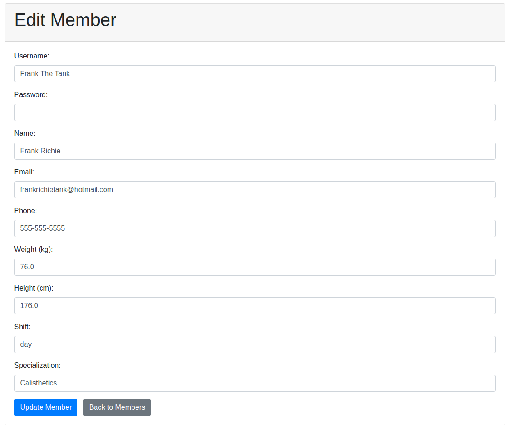

# Fitness Club Management System

## Overview
The Fitness Club Management System is a web application designed to facilitate the operations of a fitness facility. It offers functionalities for managing memberships, trainers, schedules, and attendance, with a secure authentication system. This project demonstrates the use of a modern web stack with Spring Boot and Thymeleaf to deliver a responsive and user-friendly experience for administrators, trainers, and members.

## Features
- **Admin Role**:
    - Login and manage all trainers and members.
    - Add, update, and delete trainer and member profiles.
    - View member information and trainer schedules.
- **Trainer Role**:
    - Login and manage schedules.
    - Mark attendance for members.
    - View the list of assigned members.
- **Member Role**:
    - Login and view personal schedule.
    - Update profile information.

## Technologies Used
### Backend
- **Spring Boot**: A Java-based framework for building web applications with integrated capabilities for dependency injection, security, and data management.
- **Spring Security**: Used to manage authentication and authorization, providing role-based access control for admins, trainers, and members.
- **Hibernate**: An ORM (Object Relational Mapping) tool used for managing the interaction between Java classes and the database.
- **Spring Data JPA**: Used to abstract database operations, enabling easy CRUD operations without writing boilerplate SQL code.

### Frontend
- **Thymeleaf**: A templating engine integrated with Spring Boot to render HTML pages dynamically.
- **Bootstrap**: A CSS framework used to create a responsive and visually consistent user interface across the application.
- **JavaScript/jQuery**: Used for front-end interaction and UI components to enhance the user experience.

### Database
- **H2 Database**: An in-memory relational database used for rapid development and testing. The system can easily be adapted to use MySQL or PostgreSQL in a production environment.

### Other Technologies
- **Lombok**: Reduces boilerplate code by providing annotations to generate getters, setters, constructors, and other common methods.
- **PasswordEncoder**: Used to hash user passwords to improve application security.

## Architecture
The application follows an MVC (Model-View-Controller) architecture:
- **Model**: Represents the business entities like `Member`, `Trainer`, and `User`.
- **View**: HTML pages rendered by Thymeleaf, providing the user interface.
- **Controller**: Manages the user interactions, processes data, and communicates between the view and the model.

## Setup Instructions
1. **Clone the Repository**
   ```bash
   git clone https://github.com/yourusername/fitness-club-management.git
   ```
2. **Navigate to the Project Directory**
   ```bash
   cd fitness-club-management
   ```
3. **Run the Application**
   Use the command below to start the Spring Boot application:
   ```bash
   ./mvnw spring-boot:run
   ```
   The application will be accessible at `http://localhost:8080`.

4. **Login Credentials**
    - **Admin**: Use the default username `admin` and password `password1` to log in as an administrator.
    - **Trainer and Member**: Trainers and members can use the credentials created by the admin.

## Usage
- **Admin Login**: Admins can add, edit, or remove trainers and members, and view all schedules.
- **Trainer Login**: Trainers can view their assigned members, mark attendance, and manage their schedule.
- **Member Login**: Members can view their personal schedule, update their profile information, and interact with trainers.

## Endpoints
### Admin Endpoints
- `/admin/dashboard` - View the admin dashboard.
- `/admin/members` - List all members.
- `/admin/members/add` - Add a new member.
- `/admin/members/edit/{id}` - Edit an existing member.
- `/admin/members/delete/{id}` - Delete a member.
- `/admin/trainers` - List all trainers.
- `/admin/trainers/add` - Add a new trainer.
- `/admin/trainers/edit/{id}` - Edit an existing trainer.
- `/admin/trainers/delete/{id}` - Delete a trainer.

### Trainer Endpoints
- `/trainer/login` - Trainer login page.
- `/trainer/dashboard` - View the trainer dashboard.
- `/trainer/schedule` - View trainer schedule.
- `/trainer/members` - List members assigned to the trainer.
- `/trainer/attendance` - Mark attendance for members.

### Member Endpoints
- `/member/dashboard` - View the member dashboard.
- `/member/schedule` - View the member's schedule.
- `/member/profile` - View and update the member's profile.

### Authentication Endpoints
- `/auth/login` - User login page.
- `/auth/register` - User registration page.

## Screenshots
- **Login**: Manage trainers, members, and view schedules.
- - **Admin Dashboard**: View personal profile and schedule.
- **Edit Members**: View member attendance and schedules.

## Future Improvements
- **Integration with Payment System**: Add functionality for membership payments.
- **Enhanced Security**: Implement multi-factor authentication.
- **Database Migration**: Move from H2 to a production-ready database like PostgreSQL.

## Contributing
Contributions are welcome! Please fork the repository and open a pull request for any feature requests or bug fixes.

## License
This project is licensed under the MIT License. Feel free to use it in your own projects.

